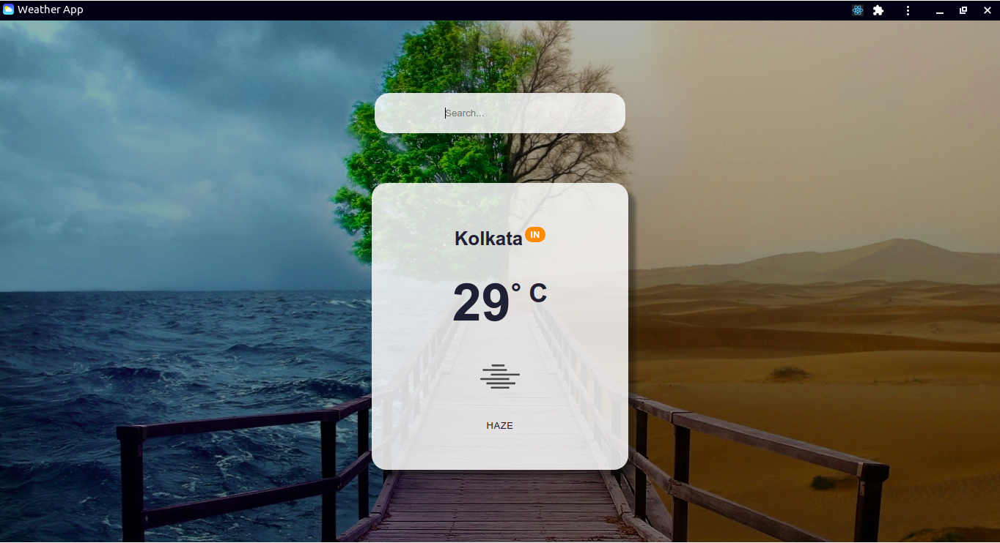

# Progressive Weather Application

A very basic example PWA built with ReactJS and Open Weather API, to fetch weather of a particular city.

## [Live Preview](https://weather-reacts.netlify.app)

## Development

### `npm start`

Runs the app in the development mode. 
Open [http://localhost:3000](http://localhost:3000) to view it in the browser.

The page will reload if you make edits. 
You will also see any lint errors in the console.

### `npm run build`

Builds the app for production to the `build` folder which is required for PWA. 
It correctly bundles React in production mode and optimizes the build for the best performance.
